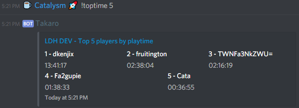

Discord
========

Chat bridge
------------

Chat from discord directly to the game.

CSMM will automatically grab new messages from the game and send them to your specified discord channel. (and from discord to game aswell)

.. image:: ../images/discord-chatbridge.png

Configured via the website, make sure to add the bot to your server

*Note: make sure the bot has read, send messages permission and permission to embed links!*

Commands
--------

Status
^^^^^^^^

Aliases: d7, day7

Quickly see some basic info about the server

.. image:: ../images/discord-command-status.png

Toptime
^^^^^^^^

Which players have spent the most time on your server?

Arguments: 
    *amount* The amount of players to show. maximum 20.

Admin/ exc commands 
-------------

Admin ex commands (also known as console commands) can be run by CSMM discord bot as long as the server owner has added you as a admin

.. image:: ../images/discord-command-excommand.png

Configuration
-------------

All discord configuration can be done via the settings page in your servers dashboard.

Link your CSMM profile to Discord
^^^^^^^^^^^^^^^^^^^^^^^^^^^^^^^^^^

Go to your profile page on CSMM, look for the Discord ID section and click the Discord icon to log in.
