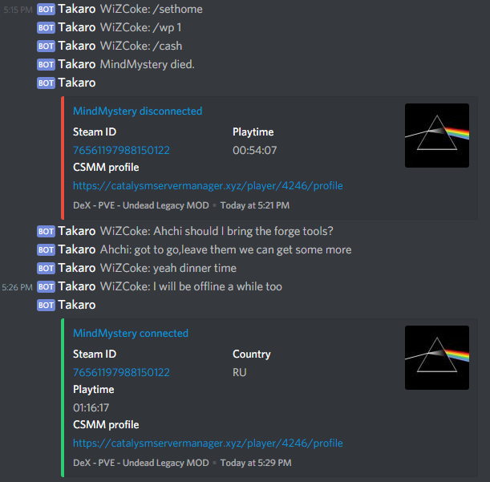
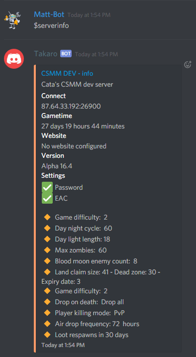

Discord
===========

Chat bridge
--------------

Chat from discord directly to the game.

CSMM will automatically grab new messages from the game and send them to your specified discord channel. (and from discord to game aswell)

Configured via the website, make sure to add the bot to your server

*Note: make sure the bot has read, send messages permission and permission to embed links!*

Commands
----------

**Multiple 7dtd servers per discord guild**

*Note: If you have multiple servers commands will take an extra argument. This server selector argument is always the last argument of the command.*

*eg: Status becomes status 1 or status 2*

Status
^^^^^^^^

Aliases: d7, day7

Quickly see some basic info about the server

.. image:: ../images/discord-command-status.png

Listservers
^^^^^^^^

Quick and basic list of the server you have

.. image:: ../images/discord-command-listservers.png

Serverinfo
^^^^^^^^

Detailed infomation about your server and settings 

Top playtime
^^^^^^^^

Which players have spent the most time on your server?

Arguments: 
    *amount* The amount of players to show. maximum 20.

.. image:: ../images/discord-command-top-playtime.png

Top zombies
^^^^^^^^

Which players have killed the most zombies on your server?

Arguments: 
    *amount* The amount of players to show. maximum 20.

.. image:: ../images/discord-command-top-zombies.png

Top deaths
^^^^^^^^

Which players have died the most on your server?

Arguments: 
    *amount* The amount of players to show. maximum 20.

.. image:: ../images/discord-command-top-deaths.png

top players
^^^^^^^^

Which players have killed the most players on your server?

Arguments: 
    *amount* The amount of players to show. maximum 20.

.. image:: ../images/discord-command-top-players.png

Top currency
^^^^^^^^

Which players have the most currency on your server?

Arguments: 
    *amount* The amount of players to show. maximum 20.

.. image:: ../images/discord-command-top-currency.png

Top level
^^^^^^^^

Which players have the highest level on your server?

Arguments: 
    *amount* The amount of players to show. maximum 20.

.. image:: ../images/discord-command-top-level.png

Top score
^^^^^^^^

Which players have the highest score your server?

Arguments: 
    *amount* The amount of players to show. maximum 20.

.. image:: ../images/discord-command-top-score.png

Player
^^^^^^^^
detailed Player profile lookup 

.. image:: ../images/Discord-player-command.png

Admin commands 
---------------------

Lookup
^^^^^^^^
detailed lookup for admins including inventory and steam id

.. image:: ../images/Discord-Lookup-command.png

Admin exec console commands
^^^^^^^^
Admin ex commands (also known as console commands) can be run by CSMM discord bot as long as the server owner has added you as a admin

*Note: If you have multiple servers ex commands will take an extra argument. This server selector argument is always the last argument of the command.*

*eg: ex mem becomes ex "mem" 1 or ex "mem" 2 or ex 'say "hello everyone"' 2*

.. image:: ../images/discord-command-excommand.png

Notifications
----------
**Ticket Notfiication**

*Discord ticket notificaiton for csmms ticket function $calladmin*

.. image:: ../images/discord-ticket-notification.png

**Lost and Connected Notification**

*Get notified when csmm loses and connects to your 7days server*

.. image:: ../images/discord-connection-notification.png

**CSMM Restart Notfiication**

*A notification that shows when csmm restarts*

.. image:: ../images/discord-restart-notification.png

**Chatbridge Notfiication**

*A notifcation that shows what channel in discord is set for chatbridge*

.. image:: ../images/discord-chatbridge-notification.png

**Country Ban Notfiication**

*A notification that shows when a player get banned for a country you have set for country ban in csmm*

.. image:: ../images/discord-countryBan-notification.jpg

Configuration
-------------

All discord configuration can be done via the settings page in your servers dashboard.

Link your CSMM profile to Discord
^^^^^^^^^^^^^^^^^^^^^^^^^^^^^^^^^^

Go to your profile page on CSMM, look for the Discord ID section and click the Discord icon to log in.
